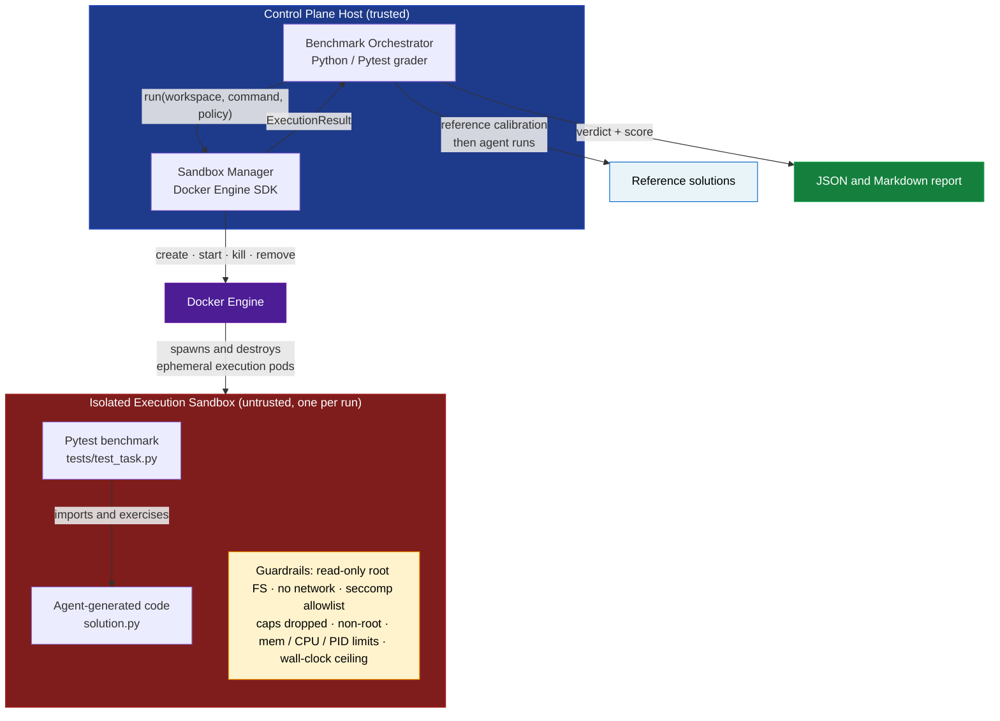
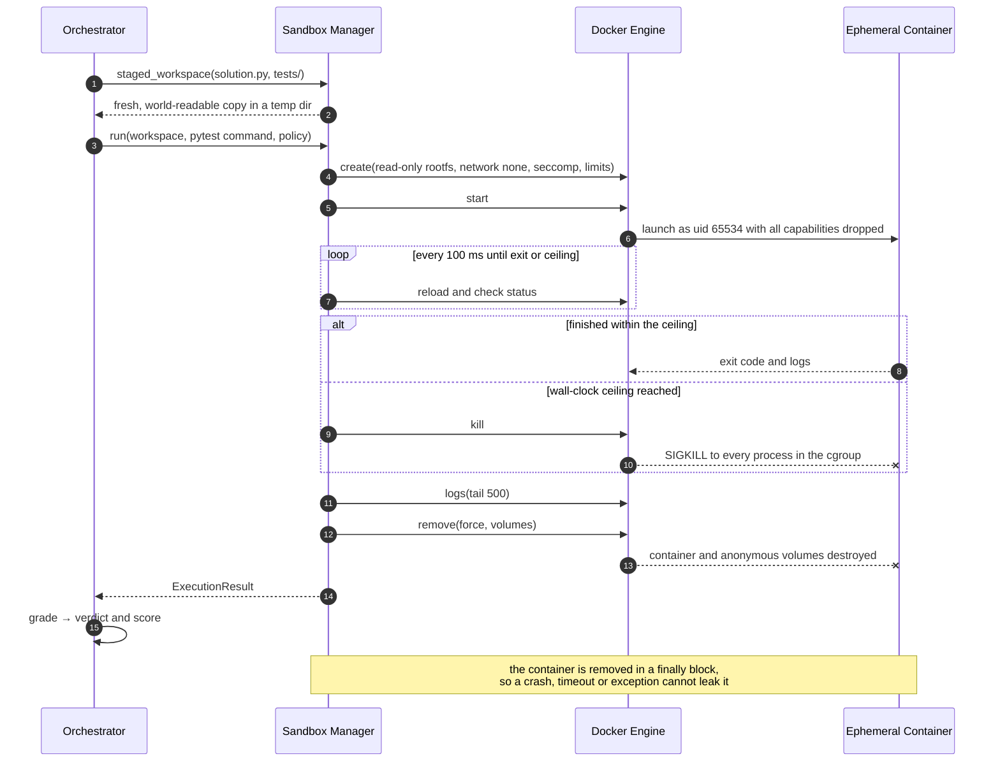
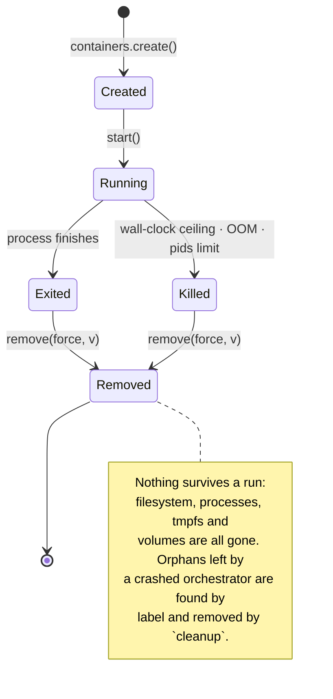
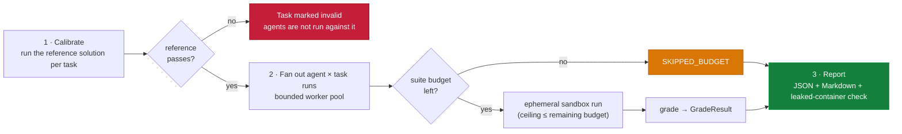
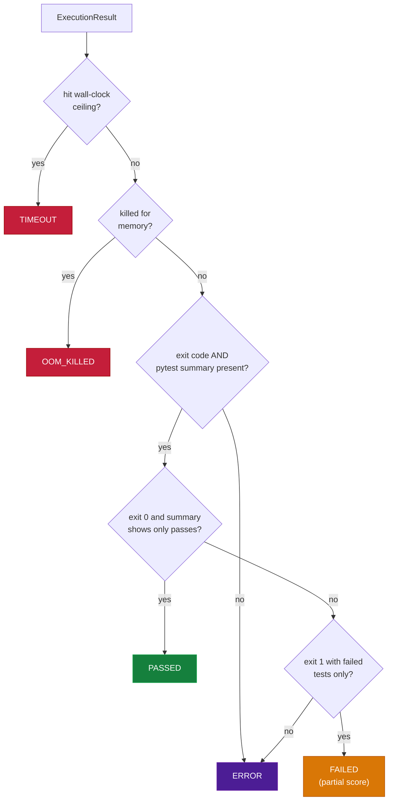

# Isolated DevSecOps Sandbox & AI Agent Benchmarking

Ephemeral, locked-down Docker sandboxes for safely running and grading code written by AI agents — multi-step coding and DevOps tasks — without putting the machine that runs the benchmark at risk.

Each evaluation run gets its own short-lived container with a **read-only root filesystem, no network, a tightened seccomp allowlist, all capabilities dropped, and hard CPU / memory / PID / wall-clock ceilings**. A Pytest-based orchestrator grades the output against reference solutions and refuses to trust anything the untrusted code could have forged.

---

## The problem

Evaluating an agent that *executes* code is different from evaluating one that only *writes* it. An agent can, deliberately or by accident:

- generate malicious code or attempt a **container escape**,
- fall into an **infinite loop** or a **fork bomb**,
- **exhaust memory** and take the host with it,
- leave files or processes behind that **contaminate the next run**, quietly changing benchmark results.

Running that on shared infrastructure is a gamble. The alternative is to treat every run as hostile: give it a disposable, tightly constrained environment, watch it against hard ceilings, and destroy the environment afterwards no matter what happened.

**Trade-off.** Creating and destroying a container per run adds overhead compared with reusing a long-lived worker. This project accepts that cost on purpose: isolating untrusted execution is worth more than the seconds it takes, and the overhead is bounded and measurable (see [Design decisions](#design-decisions-and-trade-offs)).

---

## Architecture



The orchestrator and the sandbox manager talk through a single narrow call, `SandboxManager.run(workspace, command, policy)`. Here they run in one process; because the boundary is that small, putting an RPC / gRPC hop between a scheduler and a fleet of sandbox hosts is a mechanical change (see [Roadmap](#roadmap)).

### Anatomy of one run



### Container lifecycle



---

## Defense in depth

No single control is trusted to hold. An attempt has to get past every layer, and each layer is verified independently.

```mermaid
flowchart LR
    U["Untrusted<br/>agent code"] --> L1["1 · seccomp allowlist<br/>dangerous syscalls return EPERM"]
    L1 --> L2["2 · no capabilities<br/>+ no-new-privileges"]
    L2 --> L3["3 · non-root uid 65534"]
    L3 --> L4["4 · read-only root FS<br/>+ noexec tmpfs"]
    L4 --> L5["5 · empty network namespace"]
    L5 --> L6["6 · cgroup limits<br/>memory · CPU · PIDs"]
    L6 --> L7["7 · wall-clock ceiling<br/>+ suite budget"]
    L7 --> H["Host<br/>protected"]

    style U fill:#7f1d1d,color:#fff,stroke:#991b1b
    style H fill:#15803d,color:#fff,stroke:#16a34a
    style L1 fill:#fff3cd,color:#000,stroke:#ff9800
    style L2 fill:#fff3cd,color:#000,stroke:#ff9800
    style L3 fill:#fff3cd,color:#000,stroke:#ff9800
    style L4 fill:#fff3cd,color:#000,stroke:#ff9800
    style L5 fill:#fff3cd,color:#000,stroke:#ff9800
    style L6 fill:#fff3cd,color:#000,stroke:#ff9800
    style L7 fill:#fff3cd,color:#000,stroke:#ff9800
```



| Guardrail | Setting (default) | Defined in |
|---|---|---|
| Network | `network_mode="none"` — loopback only, no external interfaces | `sandbox/policy.py` |
| Root filesystem | `read_only=True` | `sandbox/policy.py` |
| Writable scratch | `/tmp` tmpfs, `noexec,nosuid,nodev`, 32 MB | `sandbox/policy.py` |
| Inputs | `/workspace` bind-mounted **read-only**, a fresh copy per run | `sandbox/manager.py` |
| Privileges | `cap_drop=ALL`, `no-new-privileges`, `privileged=False`, private IPC, uid `65534` | `sandbox/policy.py` |
| Syscalls | Tightened seccomp allowlist (below) | `sandbox/seccomp.json` |
| Memory | 256 MB, swap set equal to memory (no swap) | `sandbox/policy.py` |
| CPU | 1 core quota | `sandbox/policy.py` |
| Processes | `pids_limit=64`, plus an init process to reap zombies | `sandbox/policy.py` |
| Other limits | `nofile 256`, core dumps off, max file size 16 MB, log driver capped at 1 MB | `sandbox/policy.py` |
| Time | 30 s wall clock per run, 40 min per suite | `sandbox/manager.py`, `orchestrator/runner.py` |
| Host access | no Docker socket, no host mounts, minimal environment (no secrets inherited) | `sandbox/policy.py` |

### The seccomp profile

`sandbox/seccomp.json` is **generated**, not hand-edited. `scripts/generate_seccomp.py` starts from Docker's own default profile (vendored in `sandbox/upstream/` from [moby/profiles](https://github.com/moby/profiles/blob/main/seccomp/default.json)) and tightens it deterministically:

- drops every capability-gated rule (the sandbox has no capabilities, so those rules should not exist at all),
- restricts `socket()` to `AF_UNIX`, removing `AF_INET`, `AF_NETLINK`, `AF_PACKET`, `AF_ALG` and friends as a second layer behind the empty network namespace,
- removes `ptrace`, `process_vm_readv/writev`, `kcmp`, `pidfd_getfd`, `process_madvise`, `memfd_create` (fileless execution would sidestep the `noexec` tmpfs) and the `*_by_handle_at` pair.

`clone` stays restricted to calls without namespace flags. CI fails if the committed profile drifts from the generator's output (`make test` runs the same check).

---

## Threat model

| Threat | Control | How it is verified |
|---|---|---|
| **Container escape** via privileged syscalls (`mount`, `unshare`, `ptrace`, …) | Seccomp allowlist, dropped capabilities, `no-new-privileges`, non-root | `tests/unit/test_seccomp.py`; probes `syscall_mount`, `syscall_unshare_userns`, `syscall_ptrace`, `capabilities_dropped`, `no_new_privileges`, `seccomp_filter_active`, `non_root_user` |
| **Tampering with the host or the image** | Read-only root FS, read-only workspace, `noexec` tmpfs | probes `rootfs_read_only`, `rootfs_write`, `workspace_write`, `tmp_is_noexec`, `proc_sys_write` |
| **Fileless execution** to dodge `noexec` | `memfd_create` removed from the allowlist | probe `syscall_memfd_create` |
| **Exfiltration / callbacks** | No network, `AF_UNIX`-only sockets, no Docker socket, clean environment | probes `network_egress`, `dns_resolution`, `socket_family_restricted`, `docker_socket_absent`, `environment_clean` |
| **Fork bomb** | `pids_limit`, init reaper, wall-clock kill | probe `pid_limit_stops_fork_storm`; hostile `log_parser` run |
| **Memory exhaustion** | Hard memory cap, swap disabled | probe `memory_limit_applied`; hostile `lru_cache` run → `OOM_KILLED` |
| **Infinite loop / CPU hogging** | CPU quota, wall-clock kill, suite budget | hostile `merge_intervals` run → `TIMEOUT`; runner budget tests |
| **Log flooding** | Capped log driver, `tail` on read, hard truncation | `tests/unit/test_manager.py` |
| **State contamination between runs** | One fresh container and one fresh workspace copy per run, removed with volumes, orphan cleanup by label | `test_no_state_leaks_between_runs`; the report's leaked-container count |
| **Forged results** (fake "all passed") | Pass needs exit code **and** summary line to agree; exit 0 with no summary is an `ERROR`; only the declared entrypoint file is staged; `conftest.py` loading disabled | `tests/unit/test_grader.py` |
| **Broken benchmark tasks** scoring agents unfairly | Reference-solution calibration gate | `tests/unit/test_runner.py` |

### Escape-attempt battery

`probes/escape_probes.py` runs *inside* a sandbox and actually attempts each of the things above, printing whether it was contained:

```bash
make probe
```

Every probe reports `contained`, `BREACH` or `unverified` (when the platform does not expose enough information to tell). `make probe` exits non-zero on any breach.

> **Never run `probes/escape_probes.py` directly on a host or dev container.** It attempts real privileged operations. As a safeguard it refuses to start unless `SANDBOX_PROBES=1` is set, which only the CLI does, from inside the locked-down container.

---

## How runs are scheduled



- **Calibration first.** A task is only usable if its own reference solution passes every test inside the sandbox. If it does not, the task is flagged invalid and no agent is scored against it.
- **Bounded parallelism.** `--workers` controls how many containers run at once.
- **Hard ceilings, two levels.** Each run is killed at its wall-clock ceiling (a task may *tighten* it, never loosen it). The whole suite has a budget (default 40 minutes); once it is spent, remaining runs are recorded as `SKIPPED_BUDGET` and no single run may outlive what is left.

---

## Grading

Scores are relative to the reference: `score = tests passed ÷ tests the reference passes` (capped at 1.0). This removes grader subjectivity — the same automated tests judge every agent — and keeps scores comparable across tasks.



| Verdict | Meaning |
|---|---|
| `PASSED` | Every test passed and the harness output is self-consistent |
| `FAILED` | Ran to completion; some tests failed (partial score) |
| `TIMEOUT` | Hit the wall-clock ceiling and was killed |
| `OOM_KILLED` | Exceeded the memory cap |
| `ERROR` | Crashed, collection error, no trustworthy result, or the sandbox itself failed |
| `SKIPPED_BUDGET` | The suite budget ran out before this run started |

The harness runs in the same process tree as the untrusted code, so its output is treated as *evidence*, not truth — hence the consistency rules above.

---

## Quick start

**Requirements:** Python 3.10+, Docker Engine 20.10+ (Docker Desktop works on macOS and Windows), `make`.

```bash
git clone <this-repo> && cd isolated-devsecops-sandbox
make install          # pip install -e ".[dev]"
make test             # unit tests: no Docker needed
make image            # build the immutable runner image (python + pytest)
make probe            # try to escape; expect every probe "contained"
make demo             # grade the demo agents, writes results/report-*.{json,md}
make demo-hostile     # fork bomb, memory hog and infinite loop, contained
make test-integration # the same checks as real-Docker pytest tests
```

Or call the CLI directly:

```bash
python -m orchestrator run \
  --tasks tasks --submissions submissions \
  --workers 4 --budget-seconds 2400 --wall-seconds 30 \
  --memory 256m --pids 64 --cpus 1.0
```

If a run is interrupted, `make cleanup` removes any leftover sandbox containers (they all carry the label `sandbox-benchmark=1`).

### What the demo should show

The demo agents are **scripted stand-ins**, not real models: `agent_good` submits the correct solution, `agent_flawed` submits plausible but subtly wrong code, and `agent_hostile` (kept in `submissions_hostile/`, run only inside sandboxes) attacks the host. Test counts below come from running the tasks' tests against those files; verdicts for the hostile agent are what the guardrails are designed to produce.

| agent | merge_intervals | lru_cache | log_parser |
|---|---|---|---|
| reference | ✅ PASSED (10/10) | ✅ PASSED (8/8) | ✅ PASSED (8/8) |
| agent_good | ✅ PASSED (10/10) | ✅ PASSED (8/8) | ✅ PASSED (8/8) |
| agent_flawed | ❌ FAILED (7/10) | ❌ FAILED (6/8) | ❌ FAILED (3/8) |
| agent_hostile | ⏱️ TIMEOUT (infinite loop) | 💥 OOM_KILLED (memory hog) | ⏱️ TIMEOUT or 💥 OOM_KILLED (fork bomb) |

In every case: no container is left behind and the host is unaffected.

---

## Bring your own agent

Drop each agent's output under `submissions/<agent>/<task_id>/` using the task's entrypoint name (default `solution.py`):

```
submissions/
└── my_agent/
    ├── merge_intervals/solution.py
    ├── lru_cache/solution.py
    └── log_parser/solution.py
```

`python -m orchestrator run` picks up every agent directory automatically.

### Add a task

```
tasks/<task_id>/
├── task.json              # id, title, prompt, optional entrypoint and timeout_seconds
├── tests/test_task.py     # tests that define correct behaviour (import from `solution`)
└── reference/solution.py  # known-good solution; must pass every test
```

Tests should import from the entrypoint module (`from solution import ...`). The reference is run first on every suite; a reference that fails marks the task invalid.

---

## Configuration

| CLI flag | `SandboxPolicy` field | Default | Effect |
|---|---|---|---|
| `--image` | `image` | `sandbox-runner:latest` | Runner image |
| `--memory` | `memory` | `256m` | Hard memory cap; swap disabled |
| `--cpus` | `cpus` | `1.0` | CPU quota |
| `--pids` | `pids_limit` | `64` | Max processes (fork-bomb ceiling) |
| `--wall-seconds` | `wall_clock_seconds` | `30` | Per-run hard ceiling |
| `--budget-seconds` | — | `2400` | Whole-suite ceiling |
| `--workers` | — | `4` | Concurrent sandboxes |
| `--runtime` | `runtime` | Docker default | Stronger boundary, e.g. `runsc` (gVisor) |

---

## Repository layout

```
.
├── sandbox/
│   ├── policy.py              # every guardrail, as one reviewable dataclass
│   ├── manager.py             # create · supervise · kill · always remove
│   ├── seccomp.json           # generated allowlist (do not hand-edit)
│   ├── upstream/              # vendored Docker default profile (generator input)
│   └── Dockerfile             # immutable runner image
├── orchestrator/
│   ├── runner.py              # calibration, fan-out, suite budget
│   ├── grader.py              # verdicts, scores, tamper-aware checks
│   ├── probing.py             # runs the escape battery, interprets it
│   ├── report.py              # JSON + Markdown reports
│   ├── tasks.py               # task discovery and validation
│   └── cli.py                 # `run`, `probe`, `cleanup`
├── probes/escape_probes.py    # escape attempts (runs only inside the sandbox)
├── tasks/                     # benchmark tasks: tests + reference solutions
├── submissions/               # demo agents: correct and subtly flawed
├── submissions_hostile/       # adversarial demo agent (sandbox-only)
├── scripts/generate_seccomp.py
├── tests/
│   ├── unit/                  # no Docker required
│   └── integration/           # real Docker daemon required
├── .github/workflows/ci.yml   # unit matrix + real-Docker sandbox job
├── Makefile
└── pyproject.toml
```

---

## Design decisions and trade-offs

- **One container per run.** Costs startup time and container churn; buys a clean slate every time, which is what rules out state contamination between runs. To measure the overhead on your hardware, compare a run's `duration_seconds` in the report to the wall time of the suite.
- **Read-only inputs, copied fresh.** Each run stages its own copy of the submission and tests into a temporary directory that is mounted read-only and deleted afterwards. Nothing a run does can be observed by the next.
- **Allowlist seccomp derived from Docker's default.** A profile written from scratch is easy to get subtly wrong (one missing syscall and Python fails to start). Deriving from upstream and only *removing* things keeps the profile known-good while making it stricter, and the generator makes every change reviewable.
- **Loopback still exists.** `network_mode=none` leaves the loopback interface; the `AF_UNIX`-only socket rule closes even that for these workloads. Tasks that legitimately need loopback sockets would need a looser rule.
- **A deliberate 40-minute suite ceiling.** The default budget caps the whole benchmark; it is a configurable safeguard, not a throughput claim. Measure your own suite before relying on it.

## Known limitations

Stated plainly so nobody over-trusts the boundary:

- **Containers share the host kernel.** A kernel vulnerability is a real escape path. For higher-assurance deployments run with a stronger runtime (`--runtime runsc` for gVisor, or Kata / Firecracker microVMs).
- **The grader runs next to the code it grades.** Pytest executes in the same process as the submission, so the consistency checks reduce, but do not eliminate, the room for result forgery. A stronger design grades from a separate process or container (see Roadmap).
- **Test files are readable by the submission during its run.** They are mounted read-only, not hidden. That protects their integrity, not their secrecy, so a submission could read the answer key. If test secrecy matters, grade in a second stage where the tests are only mounted after the submission has finished.
- **No network means no dependency installation at run time.** Everything the tasks need must be in the image.
- **Demo agents are scripted.** They exist to exercise the pipeline, not to measure any model.

## Roadmap

- Grade from a separate process/container with a per-run nonce, and mount tests only after the submission has run.
- Optional gVisor / Kata runtime profiles with CI coverage.
- Warm container pool to cut per-run startup cost, keeping the fresh-workspace guarantee.
- Split the orchestrator and sandbox manager across an RPC / gRPC boundary for multi-host fleets.
- Seccomp "audit" mode to learn a task-specific profile and tighten further.

---

## License

MIT — see [LICENSE](LICENSE).
